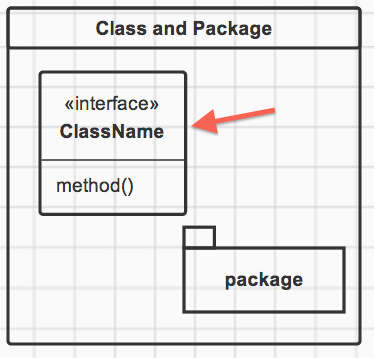
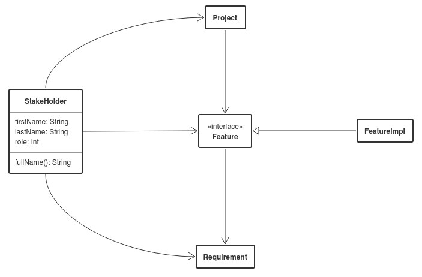
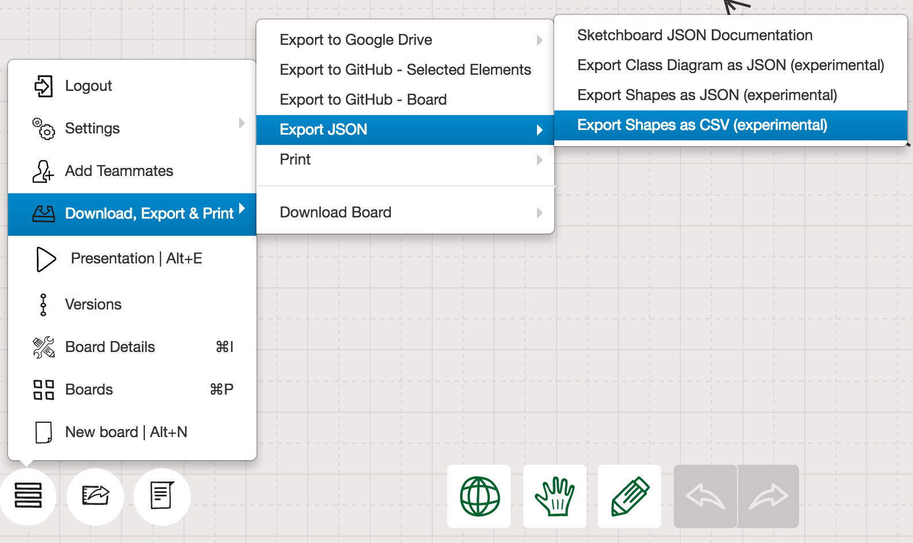
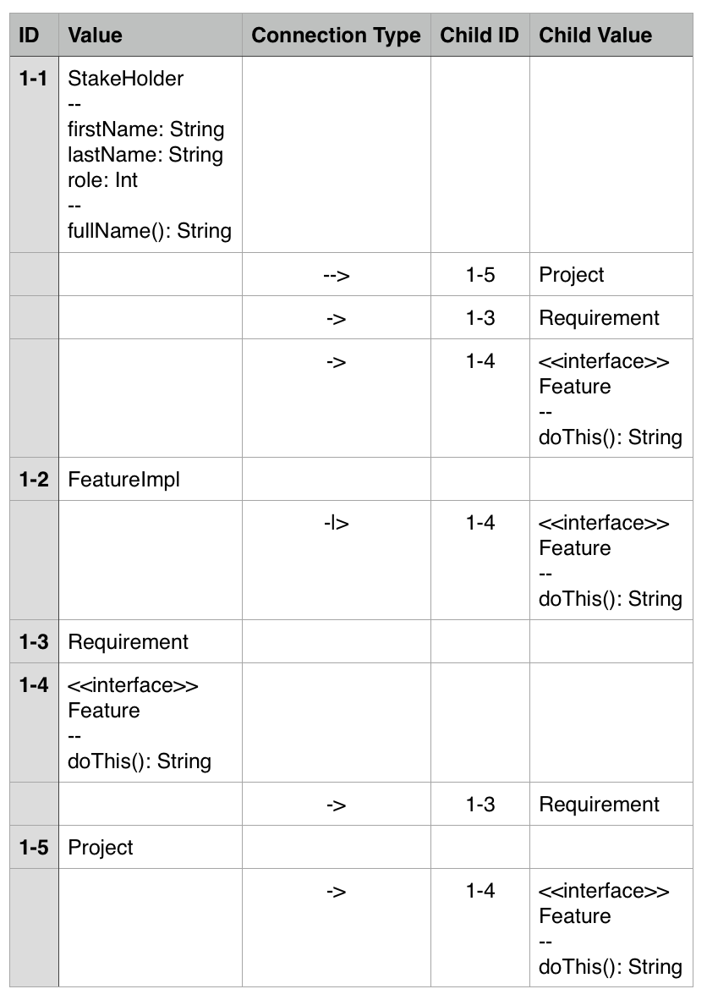

Sketchboard JSON
================

Project describes JSON document types that can be exported from https://sketchboard.me.


Creating Class Diagrams
-----------------------

Create Class Diagram on https://sketchboard.me. Diagram elements are identified as classes if class icon is used on Sketchboard.io.

Methods and attributes are defined in section after stereotype and class name. Methods are distinguished from attributes if value contains parenthesis according to UML method declaration. Section order doesn't matter for attributes and methods as long as those are after stereotype and class name.

Class syntax:
```
StakeHolder
--
firstName: String
lastName: String
role: Int
--
fullName(): String
```

#### Class element from UI Context menu


#### Class element from library


All connections between classes in version 1 are identified as relationships.


Class Diagram JSON
------------------

### Version 1 (experimental)

Version 1 exports class names, stereotypes and relationships related to classes. 



```json
[{
  "name":"StakeHolder",
  "methods":["fullName(): String"],
  "attributes":["firstName: String","lastName: String","role: Int"],
  "relationships":[{
    "name":"Project",
    "type":"->"
  },{
    "name":"Requirement",
    "type":"->"
  },{
    "name":"Feature",
    "type":"->"
  }]
},{
  "name":"FeatureImpl",
  "relationships":[{
    "name":"Feature",
    "type":"-|>"
  }]
},{
  "name":"Requirement"
},{
  "name":"Feature",
  "stereotype":"interface",
  "relationships":[{
    "name":"Requirement",
    "type":"->"
  }]
},{
  "name":"Project",
  "relationships":[{
    "name":"Feature",
    "type":"->"
  }]
}]
```

CSV export (experimental)
=========================

On a premium plan board content or selection can be exported as CSV.
Nodes are listed hierarchically. Connections have direction with parent and child relations.

CSV Export is found under the menu. You can [select shapes](https://m.sketchboard.io/long-press-starts-lasso-selection-189444a9684c) before export and only those are included in the output.



Two first columns define all nodes.

- **ID** is the node unique identifier in the board.
- **Value** is a text value of the node

Child nodes of a parent are listed right after the parent node.

- **Connection Type** defines type of the connection
- **Child ID** is the child unique identifier
- **Child Value** is the child text value


