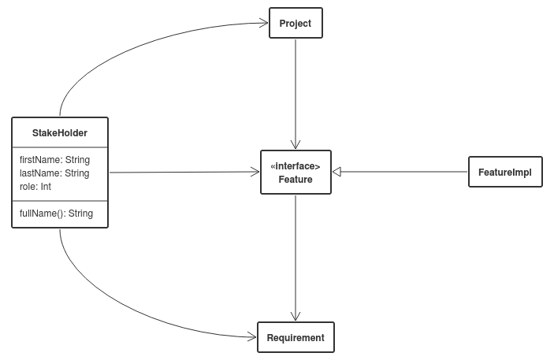

Sketchboard JSON
================

Project describes JSON document types that can be retrieved from https://sketchboard.me.

Class Diagram JSON
------------------

### Version 1 (experimental)

Version 1 exports class names, stereotypes and relationships related to classes.



```json
[{
  "name":"StakeHolder",
  "methods":["fullName(): String"],
  "attributes":["firstName: String","lastName: String","role: Int"],
  "relationships":["Project","Feature","Requirement"]
},{
  "name":"Project",
  "attributes":["name"],
  "relationships":["Feature"]
},{
  "name":"Feature",
  "stereotype":"interface",
  "relationships":["Requirement"]
},{
  "name":"Requirement"
},{
  "name":"FeatureImpl",
  "relationships":["Feature"]
}]
```
